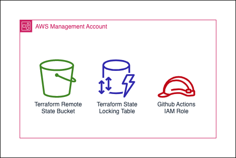

# template-mgmt-infra

This repo is a template for the AWS management account infrastructure for a given project. The following minimum set of resources are created by default:
- An S3 bucket and DynamoDB table for Terraform remote state
- OIDC identity provider and IAM Role for Github Actions

## How do I use this project to bootstrap a new AWS account?

The bootstrap directory contains terraform config to create the minimum set of resources. This is deployed from your local machine so AWS credentials are required for the account you are deploying into. 

Steps are as follows:

1. Clone this template repository with an appropriate name, e.g. `project_x-mgmt-infra`
2. Create a `terraform.tfvars.json` file with details of the AWS accounts and other project information (see `terraform.tfvars.json.example` for the format)
3. Run the `bootstrap.sh` script

## How do I add new terraform managed resources?

Create your resources in the root directory and open a pull request against the main branch to trigger a terraform plan.

## How do I give Github additional permissions to create new terraform resources in the management account?

The policy for Github Actions is contained in the bootstrap directory so you will need to deploy from your local machine using your own AWS credentials.

1. Modify `github-actions-policy.json` as required
2. Run `terraform apply`
