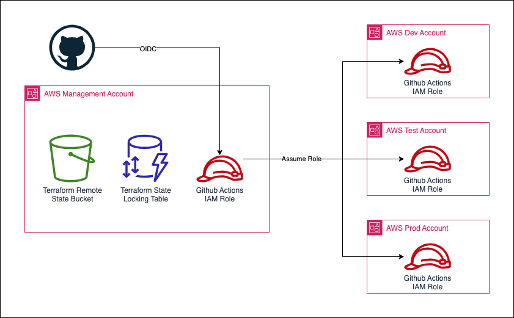

# template-mgmt-infra

This template can be used to create the AWS management account infrastructure repository for a project. The following minimum set of resources are created by default:
- An S3 bucket and DynamoDB table for Terraform remote state
- OIDC identity provider and IAM Role for Github Actions to assume in the management account
- An IAM role for Github Actions to assume in each workload account

## How do I use this template?

The bootstrap directory contains terraform config to create the minimum set of resources. This is deployed from your local machine so AWS credentials are required for the accounts you are deploying into. It is assumed that the `default` profile is configured for the management account and you have config profiles for the workload accounts. If using something other than `dev`, `test` and `prod` you can amend `bootstrap/config.tf`, `bootstrap/main.tf` and `bootstrap/outputs.tf` as appropriate. You will also need to provide the profile name for the management account in the `backend` config block if not using `default`.

Steps are as follows:
1. Clone this template repository with an appropriate name, e.g. `my-project-name_aws-mgmt-infra`. Note that the format of the repository name is important.
2. Create a `terraform.tfvars.json` file with details of the AWS accounts and other project information (see `terraform.tfvars.json.example` and make sure `my-project-name` is used as the value for the `infra-prefix` variable)
3. Run the `bootstrap.sh` script

## How do I create more AWS resources in the management account?

You might want to create more AWS resources in the management account depending on your project requirements. These resources should be created in the root directory so they can be deployed automatically by Github Actions. There is a workflow included that will automate the running of terraform plan and apply when a PR is opened against the main branch and the .tf files in the root directory have changed.

Steps are as follows:
1. Make sure you have the appropriate team/individual deployment approvals in place for the `mgmt` environment in repository settings
2. Create your resources in the root directory by modifying `main.tf`, `variables.tf` and `outputs.tf` as necessary
3. Open a pull request against the main branch to trigger a `terraform plan` 
4. Once approved, `terraform apply` will run automatically

## How do I give Github Actions permissions to create the new resources?

The policy for the Github Actions IAM role in the management account is contained in the bootstrap directory. As with the initial bootstrap process will need to deploy changes from your local machine using your own AWS credentials.

1. Modify `github_policy.tf` as required
2. Run `terraform apply`

<table><td>:warning: You should create a new Github Actions policy in `github_policy.tf` for your workload accounts with appropriate permissions for your project. By default the role created in the workload accounts is configured with the `AdministratorAccess` policy</td></table>
